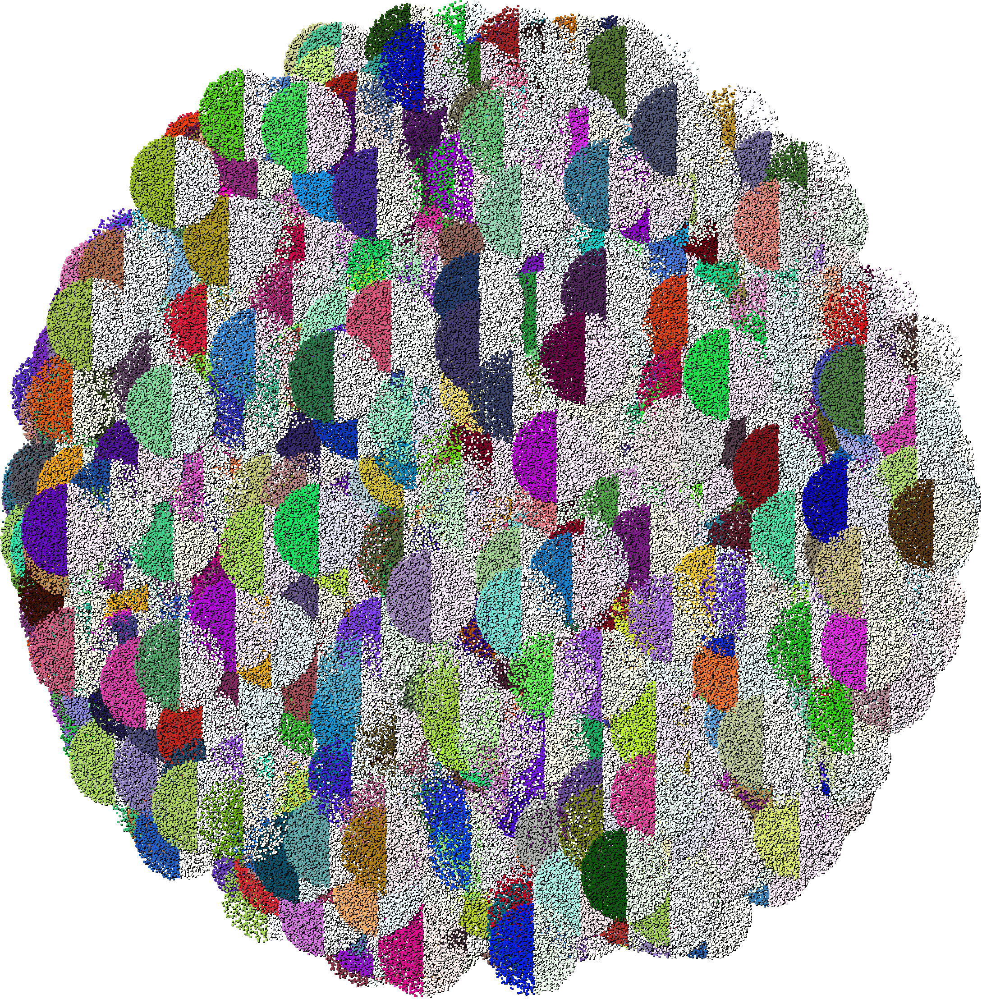
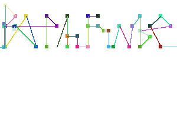
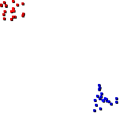
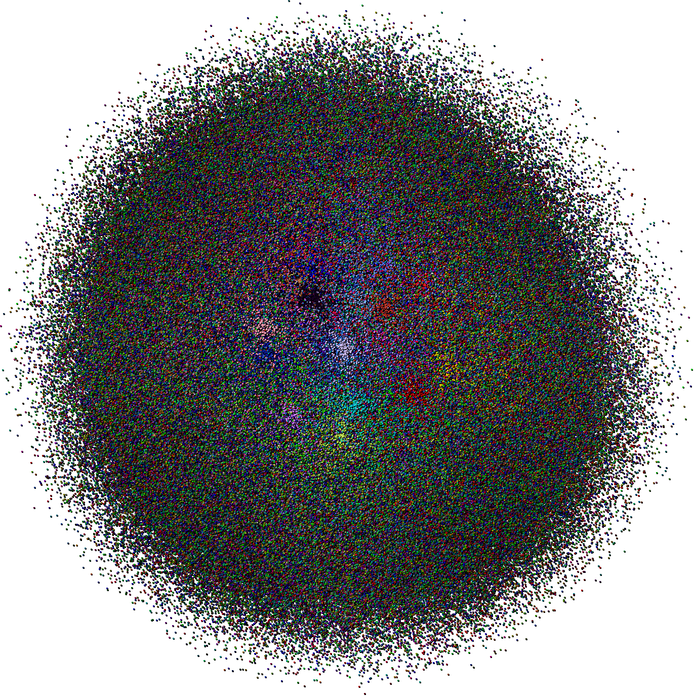

[](https://travis-ci.org/pontuslaestadius/pathfinder)
 

example: hello_world.rs


example: hello_world_gif.rs

[Documentation](https://docs.rs/pathfinder/0.2.1/pathfinder/)


example: random.rs


example: src/map/network.rs

# Introduction
Pathfinder can create nodes, groups of nodes and connection in between them, and plot them resulting in an image.
It handles text interpretation and data visualisation based on input files.
# Examples
Inside the examples directory you can find example implementations of common functions. Along with some output examples.

A Node is the primary focus. As it's properties are reflected for Groups of nodes as well.
They are instantiated simply and are used drawing on a canvas.
```
use pathfinder::{Coordinate, Node};

let coordinates = Coordinate::new(0,0);
let mut node = Node::new("name", coordinates);
```

This library contains a wrapper for image and gif encoding. Which can be used to easily draw up node, groups and links.
```
let mut map = Map::new();
map = map
    .map(&groups)
    .map(&links);

map.image.unwrap().save(&path);
```

# Planned activities
- Better abstraction for groups of nodes.
- More predictable node layout.
- Integrate with piston for live-view.
- Implement pathfinding on a linked network.
