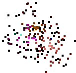

# Introduction
Pathfinder can create nodes, groups of nodes and connection in between them, and plot them resulting in an image.
It handles text interpretation and data visualisation based on input files.

[](https://travis-ci.org/pontuslaestadius/pathfinder)
 
[Documentation](https://docs.rs/pathfinder/latest/pathfinder/)

Test coverage: [58%](https://github.com/xd009642/tarpaulin)

# Examples

 the examples directory contains implementations of common functionality, Along with some output examples.




# Example

Each struct has access to the Map wrapper, which can be used to easily draw up Nodes, Groups and Links. Groups can be generated simply using add_children.

```
extern crate pathfinder;
use pathfinder::Group;
use pathfinder::map::network;
use std::path::Path;

let mut groups = Group::from_list([(0, 0), (100, 100)]);
for group in groups.iter_mut() {
    network::add_children(&mut group, 100);
}
let mut map = Map::new();
map.map(&groups)
   .save(&Path::new("out.png"));
```

