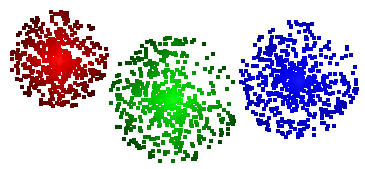

[](https://travis-ci.org/pontuslaestadius/pathfinder)
[](https://docs.rs/pathfinder/latest/pathfinder/)
[](https://github.com/xd009642/tarpaulin)
[](https://github.com/pontuslaestadius/pathfinder/blob/master/LICENSE)

# Pathfinder
> Create large number of Nodes or Groups of Nodes mapped on to an Image.

Placing positioned objects on to an Image can cause many issue. This library is meant 
to ease the pain of interacting with pixel data and create higher abstractions which
makes it easy to populate larger Image surfaces with large number of Objects!

## Getting started

Coordinates are integral, and used to position Structures on to the image. Here they are used to create a Group and a Node, and showing basic mapping functionality.

```rust
extern crate pathfinder;
use pathfinder::{Node, Coordinate, Group, Map};

fn main() {
    let node = Node::new("Hello", Coordinate::new(0, 0));
    let group = Group::new("world", Coordinate::new(50, 50));
    let mut map = Map::new();
    let map = map
        .map(&[node])
        .map(&[group]);
    /* Saving is omitted. */
}
```

The code above results in the creation of an image which contains 1 Node at positioned 0,0.
The group does not have any children Nodes and is not visable.

### Example

Easily manipulate larger number of Nodes with less accuracy.

```rust
...
use pathfinder::map::network;
use std::path::Path;

let mut groups = Group::from_list([(0, 0), (100, 100)]);
for group in groups.iter_mut() {
    network::add_children(&mut group, 100);
}
let mut map = Map::new();
map.map(&groups)
   .save(&Path::new("out.png"));
```

Produces an image with 2 Groups, each with 100 children Nodes.

## Example output




## Features

* [Connecting Nodes](https://github.com/pontuslaestadius/pathfinder/blob/master/examples/hello_world.rs)
* [Traversing paths](https://github.com/pontuslaestadius/pathfinder/blob/master/examples/mvp.rs)
* [Data visualisation](https://github.com/pontuslaestadius/pathfinder/blob/master/examples/git_log.rs)
* [Images with large number of Nodes](https://github.com/pontuslaestadius/pathfinder/blob/master/examples/random.rs)
* [Simple Gif encoding!](https://github.com/pontuslaestadius/pathfinder/blob/master/examples/hello_world_gif.rs)

