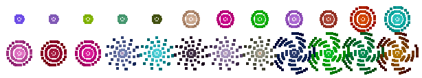
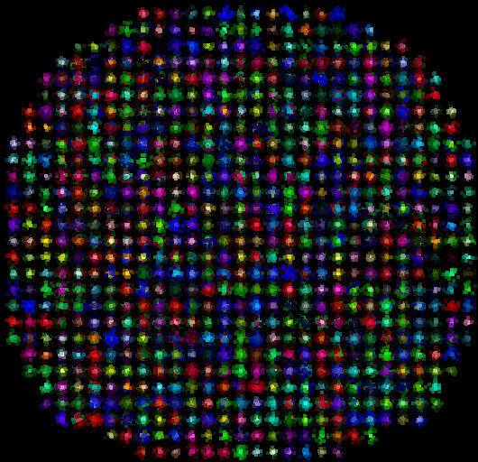

[](https://travis-ci.org/pontuslaestadius/pathfinder)
[](https://docs.rs/pathfinder/latest/pathfinder/)
[](https://github.com/xd009642/tarpaulin)
[](https://github.com/pontuslaestadius/pathfinder/blob/master/LICENSE)

# Pathfinder
> Easily create large number of Connected points mapped on to an Image or Gif.


Placing positioned objects on to an Image can cause many issue. This library is meant 
to ease the pain of interacting with pixel data and create higher abstractions which
makes it easy to populate larger Image surfaces with large number of surface objects.
Properties like width and height are internally managed.


### Features

* [Connecting Nodes](https://github.com/pontuslaestadius/pathfinder/blob/master/examples/hello_world.rs)
* [Traversing paths](https://github.com/pontuslaestadius/pathfinder/blob/master/examples/mvp.rs)
* [Data visualisation](https://github.com/pontuslaestadius/pathfinder/blob/master/examples/git_log.rs)
* [Images with large number of Nodes](https://github.com/pontuslaestadius/pathfinder/blob/master/examples/random.rs)
* [Gifs](https://github.com/pontuslaestadius/pathfinder/blob/master/examples/hello_world_gif.rs)
* [Accurately plot large number of
* Nodes](https://github.com/pontuslaestadius/pathfinder/blob/master/examples/node_plot.rs)

### Major structs

Coordinate - Holds the position and performs low-level calculations for positioning.
Node - Includes Coordinate, and adds customizations like color, size and connecting to other
Nodes.
Group - Includes Nodes in larger numbers which normalizes around it's axis.

## Example

Easily manipulate larger number of Nodes with less accuracy.

```rust
use pathfinder::{Group, map};
use std::path::Path;

let mut groups = Group::from_list([(0, 0), (100, 100)]);
for group in groups.iter_mut() {
    map::network::add_children(&mut group, 100);
}
let _ = Map::new()
    .map(&groups)
    .save(&Path::new("out.png"));
```

Produces an image with 2 Groups, each with 100 children Nodes.

### Example output





